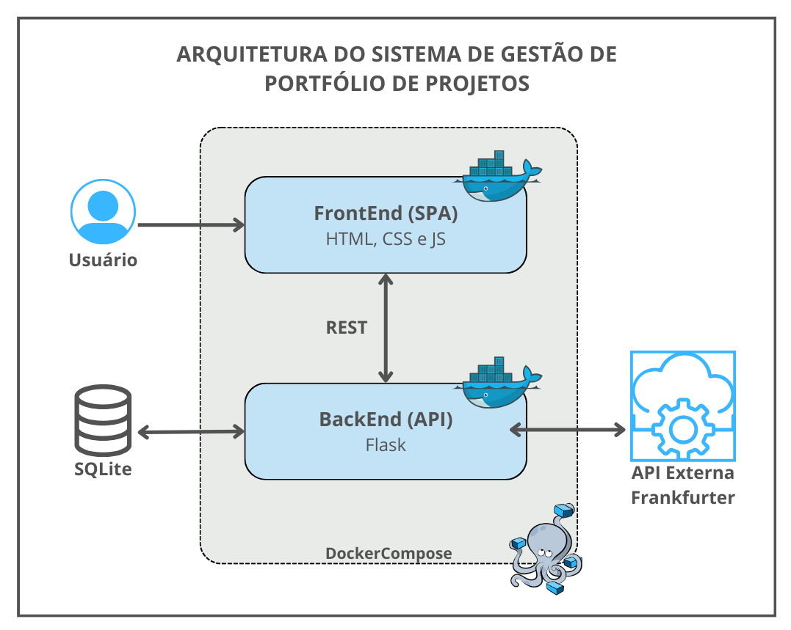

# Portfólio de Projetos - API

Este projeto foi elaborado para o MVP da disciplina **Arquitetura de Software** da Pós-Graduação.  
Seu objetivo é prover um sistema de Gestão de Portfólio de Projetos, permitindo o cadastro, edição, exclusão e o registro de históricos para cada projeto, e ainda o cadastro, edição, exclusão e consulta de recursos humanos em um projeto.
Além disso, a API possui uma integração com API externa de Conversão Monetária.

O sistema foi desenvolvido em **Python**, utilizando **Flask**, **SQLAlchemy**, **SQLite**, **Pydantic**, **Flask-OpenAPI3** e está **containerizado com Docker**.  
A API se comunica com outros módulos REST, compondo uma arquitetura distribuída com componentes independentes.

---

### Arquitetura da Solução



---

## Funcionalidades

### 1. Gerenciamento de Projetos
- Cadastro, edição e exclusão de projetos
- Atributos: ID, Nome, Sigla, Descrição, Tipo, Custo, Status e Data de Registro

### 2. Gerenciamento de Histórico
- Registro de múltiplas entradas por projeto
- Visualização de todos os históricos

### 3. Gerenciamento de Recursos
- Cadastro, edição e remoção de recursos
- Associação e desvinculação de recursos a projetos

### 4. API REST
- CRUD completo para projetos, históricos e recursos
- Documentação automática com Flask-OpenAPI3
- Padrão REST com suporte aos métodos: **GET**, **POST**, **PUT** e **DELETE**

---

## Tecnologias Utilizadas

- **Python 3.11**
- **Flask**
- **Flask-CORS**
- **Flask-OpenAPI3**
- **SQLAlchemy**
- **SQLite**
- **Pydantic**
- **Docker**

---

## Estrutura do Projeto

```
app-api/
├── app.py
├── model/
├── schema/
├── database/
├── log/
├── logger.py
├── requirements.txt
├── Dockerfile
└── README.md
```

---

## Executando com Docker

Certifique-se de ter o [Docker](https://docs.docker.com/engine/install/) instalado e em execução em sua máquina.

Navegue até o diretório que contém o Dockerfile e o requirements.txt no terminal.
Execute **como administrador** os seguintes comandos para construir a imagem Docker e executar o container:

### Build da imagem

```bash
docker build -t app-api .
```

### Executar o container

```bash
docker run -p 5000:5000 app-api
```

A aplicação estará disponível em: [http://localhost:5000](http://localhost:5000)

---
### Utilizando com Docker Compose

Se preferir, execute o backend e o frontend juntos utilizando o arquivo `docker-compose.yml`:

```bash
docker-compose up --build
```

Isso iniciará tanto a API (`app-api`) quanto a interface web (`app-front`), já configuradas para comunicação entre si.


---

## Executando Localmente (sem Docker)

### 1. Clonar o Repositório

```bash
git clone https://github.com/priscyllammoraes/back-portprojeto-arquitetura
cd back-portprojeto-arquitetura
```

### 2. Instalar bibliotecas

```bash
python -m venv venv
venv\Scripts\activate  # Windows
pip install -r requirements.txt
```

### 3. Executar a API

```bash
flask run --host 0.0.0.0 --port 5000
```

---

## Integração com API Externa – Conversão Monetária

### Justificativa

Em um portfólio de projetos, custos são geralmente registrados em moeda local (BRL), mas stakeholders podem precisar visualizar valores convertidos para moedas internacionais.  
Para atender a esse requisito de negócio, esta aplicação integra com a [Frankfurter API](https://www.frankfurter.app/), um serviço público gratuito de câmbio, que fornece taxas atualizadas com base no Banco Central Europeu.

---

### Funcionalidade Integrada: `/conversao`

A API backend oferece uma rota dedicada à conversão de moedas que encapsula a chamada externa à API Frankfurter, servindo como camada intermediária entre o frontend e o serviço externo, de modo que melhora a segurança e permite tratamento de erros centralizado.

- **Método:** `GET`
- **Rota:** `/conversao`
- **Parâmetros obrigatórios:**
  - `valor` (float): valor a ser convertido
- **Parâmetros opcionais:**
  - `de` (string): moeda de origem (padrão: `BRL`)
  - `para` (string): moeda de destino (padrão: `USD`)

---

### Exemplo de Requisição

```http
GET /conversao?valor=1000&de=BRL&para=USD
```

---

### Exemplo de Resposta

```json
{
  "valor_original": 1000.0,
  "de": "BRL",
  "para": "USD",
  "valor_convertido": 198.34
}
```

---

### Como Funciona

1. O frontend solicita a conversão de um valor registrado em um projeto.
2. O backend envia uma requisição à Frankfurter API com os parâmetros definidos.
3. A resposta da API externa é processada e retornada ao frontend com os dados convertidos.

---

### Benefícios da Abordagem

- **Abstração da API externa:** evita acoplamento direto do frontend com serviços de terceiros.
- **Facilidade de manutenção:** permite substituição futura do serviço de câmbio sem impactar a interface.
- **Validação e tratamento centralizado de erros:** como entradas inválidas ou falhas de conectividade.

---

---

## Lista de Endpoints da API

| Método | Rota                        | Descrição                                 |
|--------|-----------------------------|---------------------------------------------|
| GET    | /projetos                   | Lista todos os projetos                     |
| POST   | /projeto                    | Cria um novo projeto                        |
| PUT    | /projeto                    | Atualiza um projeto existente               |
| DELETE | /projeto?id=1               | Exclui um projeto por ID                    |
| GET    | /historico?id=1             | Lista históricos do projeto                 |
| POST   | /historico?id=1             | Adiciona um novo histórico ao projeto       |
| GET    | /recursos                   | Lista todos os recursos                     |
| POST   | /recurso                    | Cria um novo recurso                        |
| PUT    | /recurso                    | Atualiza um recurso                         |
| DELETE | /recurso?id=1               | Exclui um recurso                           |
| GET    | /projeto/recursos?id=1      | Lista recursos vinculados ao projeto        |
| POST   | /projeto/recurso            | Vincula recurso a projeto                   |
| DELETE | /projeto/recurso            | Desvincula recurso de projeto               |
| GET    | /recursos-disponiveis?id=1  | Lista recursos ainda não vinculados         |
| GET    | /conversao                  | Converte moeda via API externa              |

---

## Autor

- Priscylla Moraes  
  GitHub: [@priscyllammoraes](https://github.com/priscyllammoraes)